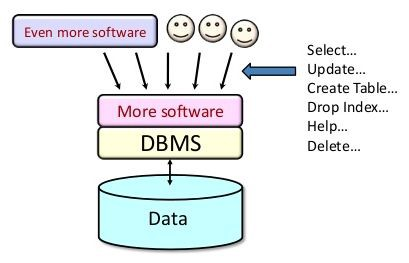
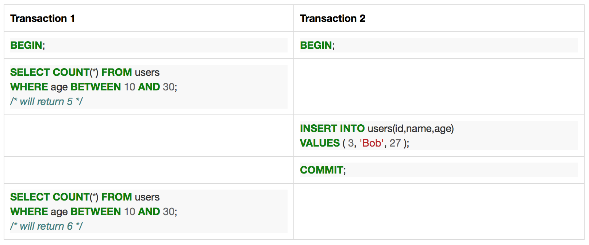

This article is part of a series. You do not have to read them in order but I will be referring to topics and explanations in previous articles:

1. [Implementing Your Own Transactions with MVCC](http://elliot.land/post/implementing-your-own-transactions-with-mvcc)

2. **SQL Transaction Isolation Levels Explained**

3. [Implementing Repeatable Read and Serializable Transaction Isolation](http://elliot.land/post/implementing-repeatable-read-and-serializable-transaction-isolation)



### **The Bad Stuff**

Before I can explain what’s different about the isolation levels we have to understand what it is that can go wrong with concurrent transactions (more than one client viewing or modifying the data at the same time).

Let’s say we have a table `users`:

```
id | name | age
1  | Joe  | 20
2  | Jill | 25
```

### Dirty Reads

A *dirty read* is when the current transaction reads a row written by another uncommitted transaction that’s currently in-flight. For example:


Basically, if the database is not able to keep track of who is changing the data (by keeping multiple versions of the same row with different visibilities) then rows be read even through they should not yet be visible to that other transaction.

### **Non-repeatable Reads**

A *non-repeatable read* occurs when the current transaction reads the same data but this time it is different. It is different because another transaction has been committed during the life of the current transaction:


Basically, the database does not maintain what the transaction has already seen so each time the data is read (such as multiple `SELECT` statements in the same transaction) the same visibility check is done on those rows but some rows may have changed in the mean time.

### **Phantom Reads**

A *phantom read* happens when the current transaction re-executes a query returning a set of rows that satisfy a search condition and finds that the set of rows satisfying the condition has changed due to another recently-committed transaction.



This can be thought of as a special type of non-repeatable read, but it is important to distinguish it as a different case because the possibility of it occurring depends on the isolation levels explained next.

The distinction is that that the original rows are re-read correctly (even if they had been changed) but a new row (or rows) have been inserted into the range it previously selected. So it hasn’t broken the re-read rule, but the data returned is still different.

### **The SQL Standard**

The SQL Standard defines four isolation levels which are described by what type of errors they are allowed to permit. It does not specify how the implementations themselves work.

In most databases MVCC is used. Sometimes with some complex rules to handle higher isolation levels built on top. However, there are other mechanisms; SQLite3 use a separate journal, for example.

- **Read uncommitted** permits dirty reads, non repeatable reads and phantom reads.
- **Read committed** permits non repeatable reads and phantom reads.
- **Repeatable read** permits only phantom reads.
- **Serializable** does not permit any read errors.

#### **Read Uncommitted**

“Read uncommitted” is the most loose transaction isolation and is in fact not even implemented in some databases because it is too loose to be useful. A transaction in this mode is susceptible to all types of read errors mentioned above since it is not required to even check if a row is committed or not.

If the database itself was not able to keep multiple version of a row but you still wanted the virtual container of a transaction to be able to perform a `ROLLBACK` this might be your only choice.

#### **Read Committed**

“Read committed” is the most common transaction isolation and usually is the default as it has the best balance between locking and performance. It will never read versions of rows that are currently uncommitted, however it is still susceptible to other transactions changing data between statements.

#### **Repeatable Read**

“Repeatable read” ensures rows that have been read (rather than modified) will still be read, even if they are changed by other transactions. This provides an almost true snapshot of the data however it does incur overhead with locking and/or causing other transactions to be rolled back more commonly.

#### **Serializable**

In a perfect world (at least for a database) we would like only one client to be connected to the database at a any given time. This would guarantee there are no side effects between concurrent clients, since there are none.

This is “Serializable”, the most strict mode and works exactly like this — client perform transactions in serial.

In practicality a database could not serve just one person at a time so some fancy internal algorithms are used to make sure that clients are not overlapping in anyway. This is tricky but means clients can concurrently work with the database but have the same guarantees as if the transactions were formed one after another.

Depending on the database system it may rollback a transaction at the time of, or at the end of the transaction if it thinks the transaction isolation has been compromised. Applications that need this level of isolation should be built carefully so that they can always retry the transaction on failure.

### **Database Vendors**

Here are some of the common database vendors and what levels of isolation they support.

#### **DB2**

DB2 supports all four database isolation levels, but has different names for each of the levels:

- Uncommitted read (UR) -> Read uncommitted.
- Cursor stability (CS) -> Read committed (default).
- Read stability (RS) -> Repeatable read.
- Repeatable read (RR) -> Serializable.

Links:

- [IBM Knowledge Center](http://www.ibm.com/support/knowledgecenter/SSEPGG_9.7.0/com.ibm.db2.luw.admin.perf.doc/doc/c0004121.html)

#### **Derby**

Derby supports all four levels of isolation, with read committed being the default.

Links:

- [Isolation levels and concurrency](https://db.apache.org/derby/docs/10.3/devguide/cdevconcepts15366.html)

#### **H2**

H2 supports only three isolation levels; read uncommitted, read committed and serializable which can only be set at the connection level (not per transaction). The default is read committed.

Links:

- [H2 — Advanced](http://www.h2database.com/html/advanced.html#transaction_isolation)

#### **MySQL and MariaDB**

When MySQL and MariaDB are using InnoDB they support all four transaction isolation levels with repeatable read as the default. Even though MySQL and MariaDB allow other pluggable engines, InnoDB is the most common when transactions are required and is usually the default engine on modern versions of either.

The original engine, MyISAM does not support transactions but it still used and available. Transaction commands will be ignored rather than result in an error. This is effectively running a database in read uncommitted mode.

Links:

1. [MySQL :: MySQL 5.7 Reference Manual :: 15.5.2.1 Transaction Isolation Levels](https://dev.mysql.com/doc/refman/5.7/en/innodb-transaction-isolation-levels.html)
2. [SET TRANSACTION — MariaDB Knowledge Base](https://mariadb.com/kb/en/mariadb/set-transaction/)

#### **Oracle**

Oracle only supports read committed (default) and serializable.

Links:

- [Ask Tom: On Transaction Isolation Levels](http://www.oracle.com/technetwork/issue-archive/2005/05-nov/o65asktom-082389.html)

#### **PostgreSQL**

PostgreSQL supports three levels; read committed, repeatable read and serializable. The syntax allows you to choose read read uncommitted but it will function as read committed.

Read committed is the default.

Links:

- [PostgreSQL: Documentation: 9.1: Transaction Isolation](https://www.postgresql.org/docs/9.1/static/transaction-iso.html)

#### **Redshift**

[Redshift](http://docs.aws.amazon.com/redshift/latest/mgmt/welcome.html)is a modified version of PostgreSQL that can only be used on [Amazon Web Services (AWS)](https://aws.amazon.com/). Redshift only supports serializable. Selecting a different isolation level will have no effect.

Links:

- [BEGIN — Amazon Redshift](http://docs.aws.amazon.com/redshift/latest/dg/r_BEGIN.html)

#### **SQL Server**

Microsoft SQL Server (which is also commonly used as a backend for Microsoft Access instead of the in-built engine) supports all four transaction isolation levels with the default being read committed.

SQL Server also has a fifth option called “snapshot” which allows transactions to see a consistent read state. It is unclear if this is an alias of another isolation level or has a specific implementation.

Links:

- [SET TRANSACTION ISOLATION LEVEL (Transact-SQL)](https://msdn.microsoft.com/en-AU/library/ms173763.aspx)

#### **SQLite3**

The default implementation of SQLite3 (since you can compile it from source with lots of different options) only works in Serialized mode.

Anyone that has dealt with SQLite3 a lot will understand that this can cause a lot of locking issues but it also the most safe safe considering all the mission-critical systems that SQLite3 is deployed in.

Since v3.7.0 write-ahead logging (WAL) has been introduced to make concurrent environments work more like other database vendors.

Links:

- [Isolation In SQLite](https://www.sqlite.org/isolation.html)
- [Write-Ahead Logging](https://www.sqlite.org/wal.html)

If your favourite database vendor is not listed, please let me know.

### **Other Resources**

- [GitHub — ept/hermitage](https://github.com/ept/hermitage): What are the differences between the transaction isolation levels in databases? This is a suite of test cases which differentiate isolation levels.